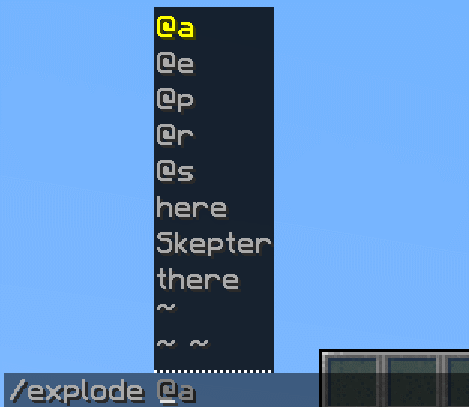

<h2 align="center">
<br>
  
  <br>
    <br>
  A Bukkit/Spigot API to use the command UI introduced in Minecraft 1.13
  <br>
</h2>

<div align="center">


[](https://discord.gg/G4SzSxZ)
<br>
[](https://www.codefactor.io/repository/github/jorelali/commandapi)


<br>


</div>

**Support and Project Discussion**:

- </img> [Discord](https://discord.gg/G4SzSxZ)
- </img> [Spigot page](https://www.spigotmc.org/resources/commandapi.62353/)
- </img> [Modrinth page](https://modrinth.com/plugin/commandapi)

**Downloads & Documentation:**

- </img> [All downloads](https://github.com/JorelAli/CommandAPI/releases)
- </img> [Documentation (includes usage for server owners!)](https://www.jorel.dev/CommandAPI/)

**Other**

- </img> [Buy me a coffee](https://ko-fi.com/jorelali)

**Compatible Minecraft versions:**

The list of what version of the CommandAPI you'll need to run on a specific version of Minecraft is as follows:

| Minecraft version  | Compatible versions         | Latest compatible<br>version | Minimum Java<br>version required<br>to run latest version |
|--------------------|-----------------------------|------------------------------|-----------------------------------------------------------|
| **1.13.x**         | v1.0 - 5.12, 8.3.0  - 8.7.5 | 8.7.5                        | 16                                                        |
| **1.14.1, 1.14.2** | v2.0 - 5.12, 8.3.0  - 8.7.5 | 8.7.5                        | 16                                                        |
| **1.14.3, 1.14.4** | v2.1 - 5.12, 8.3.0  - 8.7.5 | 8.7.5                        | 16                                                        |
| **1.15.x**         | v2.3a - 5.12, 8.3.0 - 8.7.5 | 8.7.5                        | 16                                                        |
| **1.16.1**         | v3.0 - 5.12, 8.3.0  - 8.7.5 | 8.7.5                        | 16                                                        |
| **1.16.2**         | v4.0 - 5.12, 8.3.0  - 8.7.5 | 8.7.5                        | 16                                                        |
| **1.16.3**         | v4.2 - 5.12, 8.3.0  - 8.7.5 | 8.7.5                        | 16                                                        |
| **1.16.4**         | v5.2 - 5.12, 8.3.0  - 8.7.5 | 8.7.5                        | 16                                                        |
| **1.16.5**         | v5.7 - 7.0.0, 8.3.0 - 8.7.5 | 8.7.5                        | 16                                                        |
| **1.17**           | 6.0.x - 8.7.5               | 8.7.5                        | 16                                                        |
| **1.17.1**         | 6.1.x - 8.7.5               | 8.7.5                        | 16                                                        |
| **1.18, 1.18.1**   | 6.5.2 - 8.7.5               | 8.7.5                        | 16                                                        |
| **1.18.2**         | 6.5.4 - 8.7.5               | 8.7.5                        | 16                                                        |
| **1.19**           | 8.3.0 - 8.7.5               | 8.7.5                        | 16                                                        |
| **1.19.1**         | 8.5.0 - 8.7.5               | 8.7.5                        | 16                                                        |
| **1.19.2**         | 8.5.1 - 8.7.5               | 8.7.5                        | 16                                                        |
| **1.19.3**         | 8.7.0 - 8.7.5               | 8.7.5                        | 16                                                        |

-----

## Purpose

This project provides an API to help Bukkit/Spigot developers use the Minecraft 1.13 command UI, which includes:

- **Better commands** - Prevent players from running invalid commands, making it easier for developers - you won't get dodgy input!

  

- **Better arguments** - Choose from over 50 arguments including location arguments, raw JSON, enchantments, lists, particles... all fully supported with built-in error checking!

  

- **Support for proxied command senders** - Run your command as other entities using `/execute as ... run command`

  
  
- **Argument tooltips** - Let your users know exactly what their command will do using argument tooltips

  

- **Support for the `/execute` command** - Let your command to be executed by the built in `/execute` command, as well as command blocks!

- **Support for Minecraft's functions** - Allow your command to be executed from Minecraft's functions and tags

- **No plugin.yml registration** - Commands don't need to be registered in the `plugin.yml` file anymore

- **No need for Brigadier** - You don't need to import Brigadier in your projects to use the CommandAPI

- **No tracking** - The CommandAPI doesn't collect any stats about its plugin; what you see is what you get!

Still not convinced? In addition to all of the above, the CommandAPI also provides:

- **Built-in command converter** - Convert other plugin commands into `/execute`-compatible ones - no code required!
- **Tree-structure command registration** - Like Brigadier's code format? We've got you covered with `CommandTree`
- **Kotlin DSL** - Prefer writing plugins in Kotlin? The CommandAPI has an optional Kotlin DSL just for you
- **Powerful suggestion generation** - Generate new suggestions for each argument, or add to existing suggestions
- **Safe suggestion generation** - The CommandAPI offers compile-time type safety for specific arguments
- **Precise permission support** - Apply permissions to specific arguments - you need perms to even _see_ the argument
- **Fast updates** - Consistently supports new Minecraft versions within a week of their release
- [**Insanely detailed documentation**](https://www.jorel.dev/CommandAPI/) - Trust me, you've never seen a plugin documentation look so good.

-----

## Code examples

<details>
    <summary><b>Simple command registration</b></summary>

```java
new CommandAPICommand("enchantitem")
    .withArguments(new EnchantmentArgument("enchantment"))
    .withArguments(new IntegerArgument("level", 1, 5))
    .executesPlayer((player, args) -> {
        Enchantment enchantment = (Enchantment) args[0];
        int level = (int) args[1];
        
        //Add the enchantment
        player.getInventory().getItemInMainHand().addEnchantment(enchantment, level);
    })
    .register();
```

</details>

<details>
    <summary><b>Potion removing, suggesting potions that a player has currently</b></summary>

```java
List<Argument> arguments = new ArrayList<>();
arguments.add(new EntitySelectorArgument("target", EntitySelector.ONE_PLAYER));
arguments.add(new PotionEffectArgument("potioneffect").safeOverrideSuggestions(
    (sender, prevArgs) -> {
        Player target = (Player) prevArgs[0];
        
        //Convert PotionEffect[] into PotionEffectType[]
        return target.getActivePotionEffects().stream()
            .map(PotionEffect::getType)
            .toArray(PotionEffectType[]::new);
    })
);

new CommandAPICommand("removeeffect")
    .withArguments(arguments)
    .executesPlayer((player, args) -> {
        EntityType entityType = (EntityType) args[0];
        player.getWorld().spawnEntity(player.getLocation(), entityType);
    })
    .register();
```

</details>

<details>
    <summary><b>Subcommands</b></summary>

```java
new CommandAPICommand("perm")
    .withSubcommand(new CommandAPICommand("group")
        .withSubcommand(new CommandAPICommand("add")
            .withArguments(new StringArgument("permission"))
            .withArguments(new StringArgument("groupName"))
            .executes((sender, args) -> {
                //perm group add code
            })
        )
        .withSubcommand(new CommandAPICommand("remove")
            .withArguments(new StringArgument("permission"))
            .withArguments(new StringArgument("groupName"))
            .executes((sender, args) -> {
                //perm group remove code
            })
        )
    )
    .withSubcommand(new CommandAPICommand("user")
        .withSubcommand(new CommandAPICommand("add")
            .withArguments(new StringArgument("permission"))
            .withArguments(new StringArgument("userName"))
            .executes((sender, args) -> {
                //perm user add code
            })
        )
        .withSubcommand(new CommandAPICommand("remove")
            .withArguments(new StringArgument("permission"))
            .withArguments(new StringArgument("userName"))
            .executes((sender, args) -> {
                //perm user remove code
            })
        )
    )
    .register();
```

</details>

<details>
    <summary><b>Command trees</b></summary>
	
```java
new CommandTree("perm")
    .then(new MultiLiteralArgument("group", "user")
        .then(new MultiLiteralArgument("add", "remove")
            .then(new StringArgument("permission")
                .then(new StringArgument("groupName")
                    .executes((sender, args) -> {
                        // args = ["group" or "user", "add" or "remove", permission, groupName]
                    })
                )
            )
        )
    )
    .register();
```

</details>

<details>
    <summary><b>Annotation-based commands</b></summary>

```java
@Command("warp")
public class WarpCommand {
    
    // List of warp names and their locations
    static Map<String, Location> warps = new HashMap<>();
    
    @Default
    public static void warp(CommandSender sender) {
        sender.sendMessage("--- Warp help ---");
        sender.sendMessage("/warp - Show this help");
        sender.sendMessage("/warp <warp> - Teleport to <warp>");
        sender.sendMessage("/warp create <warpname> - Creates a warp at your current location");
    }
    
    @Default
    public static void warp(Player player, @AStringArgument String warpName) {
        player.teleport(warps.get(warpName));
    }
    
    @Subcommand("create")
    @Permission("warps.create")
    public static void createWarp(Player player, @AStringArgument String warpName) {
        warps.put(warpName, player.getLocation());
    }
    
}
```

</details>

<details>
    <summary><b>Command conversion (no compilation required)</b></summary>

```yml
plugins-to-convert:
  - Essentials:
    - speed <speed>[0..10]
    - speed <target>[minecraft:game_profile]
    - speed (walk|fly) <speed>[0..10]
    - speed (walk|fly) <speed>[0..10] <target>[minecraft:game_profile]
```

</details>

-----

## Dependencies

Bukkit plugin (shaded) dependencies:

- [Item-NBT-API](https://github.com/tr7zw/Item-NBT-API) (MIT License)

-----

## Building the CommandAPI

The CommandAPI is built using the Maven build tool - if you don't have it, you can download it [here](https://maven.apache.org/download.cgi).

- Clone the repository using your preferred method, or with the command below:

  ```bash
  git clone https://github.com/JorelAli/CommandAPI.git
  ```

- Run `mvn`

The resulting plugin `.jar` is found in `commandapi-plugin/target/CommandAPI-X.X.X_DATE.jar`

## Building the CommandAPI's documentation

The CommandAPI's documentation is built using a custom version of [mdBook](https://rust-lang.github.io/mdBook/), a command line tool to create "books" with Markdown. This custom version can be found [in my mdBook fork](https://github.com/JorelAli/mdBook/releases).

- (Optional): Build the CommandAPI first, using the instructions above. The documentation pulls information directly from tests in the source code, so it assumes that those tests compile correctly!

- Get a copy of mdbook fork executable.
  - On Windows, download `mdbook-fa5.exe` from the [mdBook FA5 support](https://github.com/JorelAli/mdBook/releases/tag/v0.4.9) release
  - On Linux:
    - Clone my [mdBook fork](https://github.com/JorelAli/mdBook) using your preferred method, or with the command below:

      ```bash
      git clone https://github.com/JorelAli/mdBook.git
      ```

    - Use git to checkout to the `fa5` branch, using the following command:

      ```bash
      git checkout fa5
      ```

    - Build the executable with `cargo` (can be installed using `sudo apt-get install cargo` on Ubuntu distros), using the following command:

      ```bash
      cargo build
      ```

    - Grab the executable `mdbook` from `mdBook/target/debug/`

- Navigate to the `docssrc` folder

- Run `mdbook-fa5.exe build` (or `mdbook build` on Linux)

The resulting compiled documentation is found in `docs/X.X.X`, where `X.X.X` is specified in the `book.toml` file's `build-dir` in the `docssrc` folder.

-----

## CommandAPI Project Timeline

This is the current roadmap for the CommandAPI (as of 2nd November 2022):

- **9.0.0:**

  Project refactor in preparation for supporting Velocity, Sponge, Fabric etc.

- **After 9.0.0:**

  **Annotation improvements**

  The CommandAPI's annotation system has always been a bit limited and was primarily introduced as a proof-of-concept. In this update, the CommandAPI's annotation system will be improved to be (ideally) as powerful as the non-annotation system and have slightly better type safety, support for non-static methods and better checks to prevent invalid command generation.

- **Future:**

  **Argument conflict detection**

  The CommandAPI simply uses the Brigadier system under the hood. This system is prone to _argument conflicts_, which is where certain arguments are given priority over other arguments. (For example "hello" and "123" are both valid string arguments, but if you have a command that has a string argument or an integer argument, Brigadier may ignore the integer argument). In this update, the CommandAPI will try to spot potential conflicts and add a warning in the console. The research required for this is also required in order to implement optional arguments (which is not coming out in this release).

  **'True' custom arguments and server-side argument implementations**

  Through some brief testing of the [regex-mod branch](https://github.com/JorelAli/CommandAPI/tree/dev/regex-mod) and my [MinecraftRegexArgumentMod](https://github.com/JorelAli/MinecraftRegexArgumentMod) repository, it was discovered that 'true' custom arguments (arguments with a custom implementation of the returned type and parser) are possible with the aid of a client-sided mod. Additionally, this functionality also works _without_ a client-sided mod, assuming this is only used server-side. This can be useful for server-only datapacks, functions and tags, as well as command blocks. It is possible that this may lead into being ported to Fabric, but there are no concrete plans to do so as of now.

-----

## Changelog

<table width="100%">
    <thead>
        <tr>
            <th width="10%">Version</th>
            <th width="15%">Date</th>
            <th width="65%">Features / Changes</th>
        </tr>
    </thead>
    <tbody>
        <tr>
            <td valign="top"><b>9.0.0</b></td>
            <td valign="top">??? 2023</td>
            <td valign="top">
                <b>⚠️ This version is incompatible with any plugin that used the CommandAPI version 8.7.x or below! (See documentation for more information)</b><br>
                <b>New features:</b>
                <ul>
                    <li>https://github.com/JorelAli/CommandAPI/issues/360, https://github.com/JorelAli/CommandAPI/pull/369 Made executor methods now use <code>CommandArguments</code> to allow for accessing arguments by name instead of index</li>
                    <li>https://github.com/JorelAli/CommandAPI/issues/162, https://github.com/JorelAli/CommandAPI/issues/387, https://github.com/JorelAli/CommandAPI/pull/393 Added optional arguments</li>
                    <li>https://github.com/JorelAli/CommandAPI/pull/388 Added new <code>hook-paper-reload</code> config option to toggle whether the CommandAPI hooks into <code>/minecraft:reload</code></li>
                    <li>Reworked the implementation of <code>ItemArgument</code>, so the <code>ItemStack</code> count is correctly reflected and <code>ItemMeta</code> is properly assigned</li>
                    <li>Made the <code>TeamArgument</code> return a <code>Team</code> instead of a String</li>
                    <li>Made the <code>ObjectiveArgument</code> return a <code>Objective</code> instead of a String</li>
                    <li>https://github.com/JorelAli/CommandAPI/pull/391 Made the CommandAPI only complain about commands registered in a <code>plugin.yml</code> if this <code>plugin.yml</code> belongs to the plugin calling the CommandAPI</li>
                </ul>
                <b>Kotlin DSL changes:</b>
                <ul>
                    <li>Implemented resulting executors</li>
                    <li>Implemented the <code>FunctionArgument</code></li>
                    <li>Several improvements for the <code>CommandAPICommand</code> DSL</li>
                </ul>
                <b>Bug fixes:</b>
                <ul>
                    <li>Fixed <code>commandapi-preprocessor</code> appearing in the plugin and shaded jar file</li>
                    <li>https://github.com/JorelAli/CommandAPI/issues/390 Fixed <code>.executesNative()</code>'s CommandSender's <code>getLocation()</code> method returning the wrong pitch and yaw</li>
                    <li>Fixed tags showing up in the <code>BiomeArgument</code> when they shouldn't have been doing so</li>
                    <li>Fixed <code>LocationArgument</code> with <code>BLOCK_POSITION</code> not returning locations in unloaded chunks</li>
                </ul>
                <b>Testing and validation:</b>
                <ul>
                    <li>Created the testing matrix to perform multi-Minecraft-version testing</li>
                    <b>Bugs found (and fixed) as a result of the testing matrix:</b>
                    <ul>
                        <li>Fixed <code>IntegerRangeArgument</code> and <code>FloatRangeArgument</code> not working on Minecraft 1.16.4 and 1.16.5</li>
                        <li>Fixed <code>RecipeArgument</code> not working on Minecraft 1.17</li>
                        <li>Fixed <code>TeamArgument</code> not working on Minecraft 1.17</li>
                        <li>Fixed commands with no executors not being caught by the CommandAPI</li>
                    </ul>
                    <li>Integrated the CommandAPI repository with SonarCloud to identify bugs and improve the internal code</li>
                    <b>Bugs found (and fixed) as a result of using SonarCloud:</b>
                    <ul>
                        <li>Fixed the <code>FunctionArgument</code> not correctly retrieving datapack (function) tags in 1.17+</li>
                    </ul>
                </ul>
                <b>Documentation changes:</b>
                <ul>
                    <li>https://github.com/JorelAli/CommandAPI/issues/384 Fixed various particle data not being documented for the <code>ParticleArgument</code> documentation page</li>
                    <li>Fixed broken links in the documentation (using <a href="https://github.com/Michael-F-Bryan/mdbook-linkcheck">Michael-F-Bryan/mdbook-linkcheck</a>)</li>
                    <li>Refactored documentation argument page names for consistency</li>
                    <li>Added Kotlin DSL examples</li>
                </ul>
                <b>Other changes:</b>
                <ul>
                    <li>Removed all previously deprecated constructors, classes and methods</li>
                    <li>Completely refactored the entire CommandAPI project to help support other platforms</li>
                    <li>Added a live dev build of the documentation at <a href="https://commandapi-live-docs.jorel.dev/">commandapi-live-docs.jorel.dev</a></li>
                    <li>Improved mobile support for the CommandAPI home page</li>
                    <li>Added the CommandAPI's Modrinth link to the CommandAPI home page</li>
                    <li>Dropped support for Minecraft 1.13 - 1.14.4. Please use an older version of the CommandAPI, or raise an issue on GitHub to bring back support for these versions</li>
                </ul>
                <b>GitHub Actions changes:</b>
                <ul>
                    <li>Fixed NodeJS 12 deprecation warnings</li>
                    <li>Added markdownlint to verify that the documentation adheres to suitable Markdown standards</li>
                    <li>Fixed building the CommandAPI example projects not failing if they failed to compile</li>
                    <li>Added the CommandAPI documentation to GitHub Actions</li>
                    <li>Added deployment of snapshot builds to GitHub Actions</li>
            </td>
        </tr>
        <tr>
            <td valign="top"><b>8.7.5</b></td>
            <td valign="top">February 2023</td>
            <td valign="top">
                <ul>
                    <li>Fixed <code>@AWorldArgument</code> annotation not being handled by the annotation processor</li>
                </ul>
            </td>
        </tr>
        <tr>
            <td valign="top"><b>8.7.4</b></td>
            <td valign="top">January 2023</td>
            <td valign="top">
                <ul>
                    <li>Fixed <code>LootTableArgument</code> (function, recipe, sound, advancement, biome and entities) in 1.17 - 1.19.3</li>
                </ul>
            </td>
        </tr>
        <tr>
            <td valign="top"><b>8.7.3</b></td>
            <td valign="top">January 2023</td>
            <td valign="top">
                <ul>
                    <li>https://github.com/JorelAli/CommandAPI/issues/397 Fixed <code>WorldArgument</code> not working in 1.16.5</li>
                </ul>
            </td>
        </tr>
        <tr>
            <td valign="top"><b>8.7.2</b></td>
            <td valign="top">January 2023</td>
            <td valign="top">
                <ul>
                    <li>Hotfixed issue where various arguments wouldn't work in 1.19.3 (function, recipe, sound, advancement, biome, entities, loot table)</li>
                    <li>Fixed issue where the <code>WorldArgument</code> wouldn't work in 1.19.3</li>
                </ul>
            </td>
        </tr>
        <tr>
            <td valign="top"><b>8.7.1</b></td>
            <td valign="top">December 2022</td>
            <td valign="top">
                <ul>
                    <li>https://github.com/JorelAli/CommandAPI/issues/310 Hotfixed a null pointer exception with redirected commands</li>
                    <li>https://github.com/JorelAli/CommandAPI/issues/383 Fixed <code>ParticleArgument</code> not working in 1.19.3</li>
                    <li>Fixed <code>EnchantmentArgument</code> not working in 1.19.3</li>
                    <li>Fixed JavaDocs in IDEs not working when using <code>commandapi-shade</code></li>
                    <li>Hotfixed permission check failing when permissions have been incorrectly initialized</li>
                </ul>
            </td>
        </tr>
        <tr>
            <td valign="top"><b>8.7.0</b></td>
            <td valign="top">December 2022</td>
            <td valign="top">
                <ul>
                    <li><b>Note: This version is incompatible with any plugin that used the <code>SoundArgument</code> in version 8.6.0! (See documentation for more information)</b></li>
                    <li>Adds support for Minecraft 1.19.3</li>
                    <li>Deprecates Argument "type" constructors in favour of static inner classes</li>
                </ul>
            </td>
        </tr>
        <tr>
            <td valign="top"><b>8.6.0</b></td>
            <td valign="top">December 2022</td>
            <td valign="top">
                <ul>
                    <li>https://github.com/JorelAli/CommandAPI/issues/307 Adds a <code>CommandArgument</code> to let users submit commands as an argument</li>
                    <li>https://github.com/JorelAli/CommandAPI/issues/330 Improve the documentation for disabling the CommandAPI gracefully with <code>CommandAPI.onDisable()</code></li>
                    <li>https://github.com/JorelAli/CommandAPI/issues/334 Adds support for chat components in <code>CommandAPI.fail()</code></li>
                    <li>https://github.com/JorelAli/CommandAPI/issues/338 Adds a way to clone a <code>CommandAPICommand</code> instance using <code>instance.copy()</code></li>
                    <li>https://github.com/JorelAli/CommandAPI/issues/340 Adds Kotlin examples in the documentation</li>
                    <li>https://github.com/JorelAli/CommandAPI/issues/341 Fix incorrect code block in normal executors documentation page</li>
                    <li>https://github.com/JorelAli/CommandAPI/issues/351 Adds support for a ListArgument with the TextArgument backend, to allow inline lists</li>
                    <li>https://github.com/JorelAli/CommandAPI/issues/358 Adds a new WorldArgument argument that lets you get a list of Minecraft dimensions</li>
                    <li>Adds support for <code>SoundArgument</code> to return string-based sounds via the <code>NamespacedKey</code></li>
                    <li>https://github.com/JorelAli/CommandAPI/pull/352 Adds some helper methods to the LiteralArgument to make it easier to use via a static import</li>
                    <li>https://github.com/JorelAli/CommandAPI/pull/357 Adds a Kotlin DSL to register commands in Kotlin!</li>
                </ul>
            </td>
        </tr>
        <tr>
            <td valign="top"><b>8.5.1</b></td>
            <td valign="top">August 2022</td>
            <td valign="top">
                <ul>
                    <li>https://github.com/JorelAli/CommandAPI/issues/311 Fix packets with invalid signatures kicking the client when sending certain commands with a chat preview enabled argument</li>
                    <li>https://github.com/JorelAli/CommandAPI/issues/312 Safeguards against command paths with duplicate node names which could cause the client to crash</li>
                    <li>https://github.com/JorelAli/CommandAPI/issues/313 Fix subcommand information being overwritten after a command has been registered</li>
                    <li>https://github.com/JorelAli/CommandAPI/issues/314 Fix <code>TimeArgument</code> not working as intended</li>
                    <li>https://github.com/JorelAli/CommandAPI/issues/316 Fix server reloading on Spigot throwing asynchronous-related exceptions in the console</li>
                    <li>https://github.com/JorelAli/CommandAPI/issues/323 Fix <code>NamespacedKeyArgument</code> not working in 1.17</li>
                    <li>Fix various command issues with Minecraft versions before 1.19</li>
                    <li>Fix argument suggestions not working if a subcommand's node name is the same as the argument's node name</li>
                    <li>Improves the underlying implementation of chatcolor, enchantment and potion arguments in 1.17+</li>
                    <li>Improves NMS code sharing between 1.19, 1.19.1 and 1.19.2</li>
                    <li>Improves the implementation of the list argument to only display suggestions for the last item in the list and prevent unlisted items being entered</li>
                    <li>Adds support for Minecraft 1.19.2</li>
                </ul>
            </td>
        </tr>
        <tr>
            <td valign="top"><b>8.5.0</b></td>
            <td valign="top">July 2022</td>
            <td valign="top">
                <b>Development improvements:</b>
                <ul>
                    <li>Improves the issue templates on GitHub for creating bug reports and feature requests</li>
                    <li>Adds a testing suite for the CommandAPI which can test for successful command registration and execution</li>
                    <li>Adds an example of shading the CommandAPI with Maven in <code>examples/maven-shaded/</code></li>
                </ul>
                <b>Bug fixes:</b>
                <ul>
                    <li>Fixes suggestions not working in 1.16.5 and below due to Brigadier implementation versions</li>
                    <li>Fixes the CommandAPI allowing spaces in command names</li>
                    <li>Fixes datapack reloading on 1.17.1</li>
                </ul>
                <b>New features/improvements:</b>
                <ul>
                    <li>Adds support for Minecraft 1.19.1</li>
                    <li>Adds support for chat preview with <code>ChatArgument</code> and <code>AdventureChatArgument</code></li>
                    <li>Adds a <code>CommandAPI.onDisable()</code> method to disable the CommandAPI gracefully</li>
                    <li>Adds Kotlin-DSL gradle to the documentation</li>
                    <li>Prevents the CommandAPI re-parsing previous arguments multiple times when running a command</li>
                    <li>Adds <code>CommandAPI.isLoaded()</code> to check if the CommandAPI is loaded</li>
                    <li>Shares NMS code for 1.13.x and 1.14.x, reducing the jar size</li>
                </ul>
            </td>
        </tr>
        <tr>
            <td valign="top"><b>8.4.1</b></td>
            <td valign="top">June 2022</td>
            <td valign="top">
                <ul>
                    <li>Fix issue where converted commands would handle arguments incorrectly</li>
                    <li>Fix commandapi-annotations dependency depending on spigot instead of spigot-api</li>
                </ul>
            </td>
        </tr>
        <tr>
            <td valign="top"><b>8.4.0</b></td>
            <td valign="top">June 2022</td>
            <td valign="top">
                <b>Jar minimization improvements:</b>
                <ul>
                    <li>Decouples CustomArgument from CommandAPIHandler</li>
                    <li>Decouples EntitySelector from EntitySelectorArgument</li>
                </ul>
				<b>NBT API Support:</b>
                <ul>
					<li>Allow developers to shade their own copy of an NBT API framework (e.g. NBT API or PowerNBT)</li>
					<li>Includes the NBT API built-in for plugin versions</li>
                </ul>
				<b>Other:</b>
                <ul>
                    <li>Implement base arguments for CustomArguments, allowing more powerful parsing</li>
                    <li>Implement common NMS code for 1.17+</li>
                    <li>Adds <code>NamespacedKeyArgument</code></li>
                    <li>Adds support for shaded versions of the CommandAPI to create their own <code>command_registration.json</code> files for debugging</li>
                    <li>Fixes bug where <code>WrapperCommandSyntaxException</code> wouldn't work as intended</li>
                    <li>Adds support for <code>/minecraft:reload</code> on paper servers</li>
                    <li>Adds <code>CommandAPI.getRegisteredCommands()</code> to get a list of registered commands</li>
                </ul>
            </td>
        </tr>
        <tr>
            <td valign="top"><b>8.3.1</b></td>
            <td valign="top">June 2022</td>
            <td valign="top">
                <ul>
                    <li>Fixes critical issue where non-Vanilla commands were not showing suggestions</li>
                </ul>
            </td>
        </tr>
        <tr>
            <td valign="top"><b>8.3.0</b></td>
            <td valign="top">June 2022</td>
            <td valign="top">
                <ul>
                    <li>Change Java target version to Java 16 instead of Java 17</li>
                    <li>Adds support for old Minecraft versions (1.13 - 1.16.4) again</li>
                    <li>Adds support for Minecraft 1.19</li>
                </ul>
            </td>
        </tr>
        <tr>
            <td valign="top"><b>8.2.1</b></td>
            <td valign="top">June 2022</td>
            <td valign="top">
                <ul>
                    <li>Adds a <code>.withSubcommands()</code> method to add multiple subcommands in one go</li>
                    <li>Exposed <code>registeredCommands</code> field in the CommandAPIHandler to get a list of registered commands</li>
                    <li>Fixed CommandAPI logging prefix twice in shaded versions of the CommandAPI</li>
                </ul>
            </td>
        </tr>
        <tr>
            <td valign="top"><b>8.2.0</b></td>
            <td valign="top">May 2022</td>
            <td valign="top">
                <ul>
                    <li>Adds a list argument</li>
                    <li>Brings back support for Minecraft 1.16.5</li>
                    <li>Fixes documentation bug with multiple executor types</li>
                    <li>Fixes bug where suggestions wouldn't "filter" while being typed in chat</li>
                </ul>
            </td>
        </tr>
        <tr>
            <td valign="top"><b>8.1.0</b></td>
            <td valign="top">May 2022</td>
            <td valign="top">
                <ul>
                    <li>Adds generic types to arguments to improve compile-time type checking</li>
                    <li>Fix particle data safe suggestions crashing the CommandAPI</li>
                    <li>Improves error logging of greedy string arguments</li>
                    <li>Fix bug with <code>CommandPermission.OP</code> throwing a null pointer exception</li>
                    <li>Prevent the CommandAPI crashing when shaded plugins don't call <code>CommandAPI.onLoad()</code></li>
                    <li>Fix initialization of <code>WrapperCommandSyntaxException</code> bug</li>
                </ul>
            </td>
        </tr>
        <tr>
            <td valign="top"><b>8.0.0</b></td>
            <td valign="top">April 2022</td>
            <td valign="top">
                <ul>
                    <li><b>Note: This version is incompatible with existing plugins that use the particle argument (See documentation for more information)</b></li>
                    <li>Improved support for particle arguments, now supporting particle data (e.g. color, size)</li>
                    <li>Dropped support for Minecraft 1.16.5</li>
                    <li>Adds an error message if the <code>config.yml</code>'s <code>plugins-to-convert</code> option has an invalid type</li>
                    <li>Improve <code>WrapperCommandSyntaxException</code> to include passthrough methods to access the underlying exception</li>
                </ul>
            </td>
        </tr>
        <tr>
            <td valign="top"><b>7.0.0</b></td>
            <td valign="top">April 2022</td>
            <td valign="top">
                <b>Development improvements:</b>
                <ul>
                    <li>Adds a GitHub action to build the CommandAPI (and share it's lovely artifacts)</li>
                    <li>Moves the Maven repo for 7.0.0 and future updates to Maven Central</li>
                </ul>
                <b>New features:</b>
                <ul>
                    <li>Adds support for using the same command executor for multiple command sender types</li>
                    <li>Makes the CommandAPI display a warning if it finds commands present in a <code>plugin.yml</code> file</li>
                    <li>Adds more helper methods to the Brigadier class</li>
                    <li>Adds a tree-like syntax for command declarations</li>
                    <li>Adds support for asynchronous suggestions</li>
                    <li>Rewrote how argument suggestions are declared, instead of lots of overloads, require a single object which encompasses the various different suggestion methods</li>
                </ul>
                <b>Other:</b>
                <ul>
                    <li>Fix transitive dependencies in the CommandAPI which caused various libraries to be exposed</li>
                    <li>Remove various deprecated <code>safeOverrideSuggestions</code> methods</li>
                    <li>Improve certain colors of elements in the CommandAPI's documentation so it's easier to read</li>
                    <li>Fix various broken links in the documentation</li>
                    <li>Changed <code>CommandAPI.fail()</code> so it doesn't automatically throw the exception it generates</li>
                </ul>
            </td>
        </tr>
        <tr>
            <td valign="top"><b>6.5.4</b></td>
            <td valign="top">March 2022</td>
            <td valign="top">
                <ul>
                    <li>Support for Minecraft 1.18.2</li>
                    <li>Improve converted command support for <code>/execute at</code> and <code>/execute positioned</code></li>
                </ul>
            </td>
        </tr>
        <tr>
            <td valign="top"><b>6.5.3</b></td>
            <td valign="top">December 2021</td>
            <td valign="top">
                <ul>
                    <li>Support for Minecraft 1.18.1</li>
                </ul>
            </td>
        </tr>
        <tr>
            <td valign="top"><b>6.5.2</b></td>
            <td valign="top">December 2021</td>
            <td valign="top">
                <ul>
                    <li>Fix Maven build script with 6.5.1, fixing broken CommandAPI annotation builds</li>
                </ul>
            </td>
        </tr>
        <tr>
            <td valign="top"><b>6.5.1</b></td>
            <td valign="top">December 2021</td>
            <td valign="top">
                <ul>
                    <li>Fix Maven build script with 6.5.0, fixing broken CommandAPI shaded builds</li>
                </ul>
            </td>
        </tr>
        <tr>
            <td valign="top"><b>6.5.0</b></td>
            <td valign="top">December 2021</td>
            <td valign="top">
                <ul>
                    <li>Adds support for Minecraft 1.18 (requires Java 17)</li>
                </ul>
            </td>
        </tr>
        <tr>
            <td valign="top"><b>6.4.0</b></td>
            <td valign="top">November 2021</td>
            <td valign="top">
                <ul>
                    <li>Adds support for CommandAPI command help topics via <code>/help</code></li>
                    <li>Improve CommandAPI initialization stability</li>
                    <li>(Hopefully) fix conflicting issues with duplicate Bukkit and CommandAPI command names</li>
                    <li>Code cleanup (fix a lot of minor warnings)</li>
                </ul>
            </td>
        </tr>
        <tr>
            <td valign="top"><b>6.3.1</b></td>
            <td valign="top">September 2021</td>
            <td valign="top">
                <ul>
                    <li>Fixes issue with converted commands where executing as a player with lower permissions fails</li>
                    <li>Adds very limited support for plugin reloading by unregistering commands on disable</li>
                    <li>Fixes issue where converted commands with greedy string arguments would almost always fail</li>
                </ul>
            </td>
        </tr>
        <tr>
            <td valign="top"><b>6.3.0</b></td>
            <td valign="top">August 2021</td>
            <td valign="top">
                <ul>
                    <li>Adds a new constructor to <code>CustomArgument</code> which takes in a record containing all inputs</li>
                    <li>Adds support for <code>CustomArgument</code>'s parser to use previously declared arguments</li>
                </ul>
            </td>
        </tr>
        <tr>
            <td valign="top"><b>6.2.0</b></td>
            <td valign="top">July 2021</td>
            <td valign="top">
                <ul>
                    <li>Adds config option to customize messages</li>
                    <li>Adds config option to use the latest NMS version</li>
                    <li>Update documentation instructions for shading with Maven</li>
                </ul>
            </td>
        </tr>
        <tr>
            <td valign="top"><b>6.1.0</b></td>
            <td valign="top">July 2021</td>
            <td valign="top">
                <ul>
                    <li>Adds support for 1.17.1</li>
                </ul>
            </td>
        </tr>
        <tr>
            <td valign="top"><b>6.0.5</b></td>
            <td valign="top">June 2021</td>
            <td valign="top">
                <ul>
                    <li>Fix issue where converted commands which didn't use entity selectors would always fail</li>
                </ul>
            </td>
        </tr>
        <tr>
            <td valign="top"><b>6.0.4</b></td>
            <td valign="top">June 2021</td>
            <td valign="top">
                <ul>
                    <li>Fix issue where some multi literal arguments would be skipped, causing a crash</li>
                </ul>
            </td>
        </tr>
        <tr>
            <td valign="top"><b>6.0.3</b></td>
            <td valign="top">June 2021</td>
            <td valign="top">
                <ul>
                    <li>Fix issue where custom CommandSender subclasses could not run CommandAPI commands</li>
                </ul>
            </td>
        </tr>
        <tr>
            <td valign="top"><b>6.0.2</b></td>
            <td valign="top">June 2021</td>
            <td valign="top">
                <ul>
                    <li>Fix bug where multi literal arguments would crash due to poor array preservation</li>
                </ul>
            </td>
        </tr>
        <tr>
            <td valign="top"><b>6.0.1</b></td>
            <td valign="top">June 2021</td>
            <td valign="top">
                <ul>
                    <li>Fix bug where the CommandAPI would crash if it tries to register duplicate permissions</li>
                </ul>
            </td>
        </tr>
        <tr>
            <td valign="top"><b>6.0.0</b></td>
            <td valign="top">June 2021</td>
            <td valign="top">
                <b>Version support changes:</b>
                <ul>
                    <li>Adds support for Minecraft 1.17</li>
                    <li>Drops support for Minecraft 1.16.4 and below</li>
                    <li>Changes build version from Java 8 to Java 16</li>
                </ul>
                <b>Development improvements:</b>
                <ul>
                    <li>Switches version convention to use Semanic Versioning</li>
                    <li>Uses CodeFactor.io for code quality checking</li>
                </ul>
                <b>New features:</b>
                <ul>
                    <li>Adds <code>OfflinePlayerArgument</code> for offline players</li>
                    <li>Adds a way to add suggestions to existing vanilla suggestions</li>
                    <li>Adds a way to access the <code>CommandSender</code> for <code>CustomArgument</code> parsing</li>
                    <li>Adds support for Paper's console tab-completion</li>
                    <li>Adds a way to completely silence all CommandAPI logs</li>
                    <li>Adds access to the current input and current argument input for argument suggestions</li>
                    <li>Improve API for setting configuration for plugins that shade the CommandAPI</li>
                </ul>
                <b>Bug fixes:</b>
                <ul>
                    <li>Fixes bug with converted commands crashing due to poor interface proxying</li>
                    <li>Adds a way to access the <code>CommandSender</code> for <code>CustomArgument</code> parsing</li>
                    <li>Adds support for Paper's console tab-completion</li>
                    <li>Adds a way to completely silence all CommandAPI logs</li>
                    <li>Fix bugs where the NBTAPI wouldn't be hooked into properly</li>
                    <li>Fixes critical issue where converted commands with entity selectors may sometimes just not run</li>
                </ul>
                <b>Other:</b>
                <ul>
                    <li>Improves overall performance</li>
                    <li>Improves performance for the <code>PotionArgument</code></li>
                    <li>Improves performance for the <code>MathOperationArgument</code></li>
                    <li>Fixes spacing issues with code blocks in the documentation</li>
                    <li>Fixes invalid code examples in the documentation</li>
                    <li>Fixes typos in the documentation</li>
                    <li>Adds syntax highlighting for command code blocks in the documentation</li>
                </ul>
            </td>
        </tr>
        <tr>
            <td valign="top"><b>5.12</b></td>
            <td valign="top">May 2021</td>
            <td valign="top">
                <ul>
                    <li>Moves the Maven repo for 5.12 and future updates to jitpack.io</li>
                    <li>Fixes issue with sound arguments on Minecraft 1.16.4 and 1.16.5</li>
                </ul>
            </td>
        </tr>
        <tr>
            <td valign="top"><b>5.11</b></td>
            <td valign="top">May 2021</td>
            <td valign="top">
                <ul>
                    <li>Allows converted commands to use entity selectors in plugin commands</li>
                    <li>Allows arbitrary commands to be converted with the CommandAPI's converter system</li>
                </ul>
            </td>
        </tr>
        <tr>
            <td valign="top"><b>5.10</b></td>
            <td valign="top">May 2021</td>
            <td valign="top">
                <ul>
                    <li>Adds support for Paper's Adventure API for ChatComponent and Chat arguments.</li>
                    <li>Deprecated a few methods in favour of some slightly better ones.</li>
                    <li>Update proxied sender for Spigot 1.16.5</li>
                </ul>
            </td>
        </tr>
        <tr>
            <td valign="top"><b>5.9</b></td>
            <td valign="top">February 2021</td>
            <td valign="top">
                <ul>
                    <li>Fixed a critical bug where plugin conversion would run the caller methods instead of callee methods, which prevented command blocks from running commands.</li>
                </ul>
            </td>
        </tr>
        <tr>
            <td valign="top"><b>5.8</b></td>
            <td valign="top">January 2021</td>
            <td valign="top">
                <ul>
                    <li>Removed a debug <code>/test</code> command which wasn't supposed to be released!</li>
                </ul>
            </td>
        </tr>
        <tr>
            <td valign="top"><b>5.7</b></td>
            <td valign="top">January 2021</td>
            <td valign="top">
                <ul>
                    <li>Add support for Minecraft 1.16.5</li>
                </ul>
            </td>
        </tr>
        <tr>
            <td valign="top"><b>5.6</b></td>
            <td valign="top">January 2021</td>
            <td valign="top">
                <ul>
                    <li>Fix bug where plugins that use <a href="https://github.com/aikar/commands">Aikar's ACF</a> were incompatible with the CommandAPI</li>
                    <li>Add a new configuration option <code>skip-sender-proxy</code> which prevents certain plugins from running properly</li>
                </ul>
            </td>
        </tr>
        <tr>
            <td valign="top"><b>5.5</b></td>
            <td valign="top">January 2021</td>
            <td valign="top">
                <ul>
                    <li>Fix bug with annotations where <code>@NeedsOp</code> didn't work if placed on a class</li>
                    <li>Fix bug where entity selector arguments with <code>@</code> selectors return empty values if the sender is not op</li>
                </ul>
            </td>
        </tr>
        <tr>
            <td valign="top"><b>5.4</b></td>
            <td valign="top">December 2020</td>
            <td valign="top">
                <ul>
                    <li>Fix bug where the NBT-API wasn't compatible with the CommandAPI when both are shaded into a plugin</li>
                </ul>
            </td>
        </tr>
        <tr>
            <td valign="top"><b>5.3</b></td>
            <td valign="top">November 2020</td>
            <td valign="top">
                <ul>
                    <li>Fix bug where permissions weren't being applied for subcommands and multi literal arguments</li>
                    <li>Adds detection system for command graph conflicts</li>
                    <li>Adds a way to "negate" permissions using <code>.withoutPermission</code></li>
                    <li>Adds an annotation-based command framework</li>
                    <li>Fix minor documentation inaccuracies</li>
                    <li>Fix bug where converted commands didn't apply multiple parameters</li>
                    <li>The fields in <code>CommandAPICommand</code> can now be accessed via getters and setters</li>
                </ul>
            </td>
        </tr>
        <tr>
            <td valign="top"><b>5.2</b></td>
            <td valign="top">November 2020</td>
            <td valign="top">
                <ul>
                    <li>Adds <code>CommandAPI.reloadDatapacks()</code> method to reload datapacks in the same way the CommandAPI does</li>
                    <li>Adds support for Minecraft 1.16.4</li>
                </ul>
            </td>
        </tr>
        <tr>
            <td valign="top"><b>5.1</b></td>
            <td valign="top">October 2020</td>
            <td valign="top">
                <ul>
                    <li>Fixes bug where converted commands could not be executed by players ingame</li>
                    <li>Adds <code>withPermission(String)</code> to arguments and CommandAPICommands</li>
                    <li>Adds SimpleFunctionWrapper with helper methods to get functions and tags from ingame, as well as run them without needing to parse them via commands</li>
                    <li>Greatly improve the type-safety of the internal CommandAPI code</li>
                    <li>Move the <code>Brigadier</code> class outside of the <code>CommandAPIHandler</code> class</li>
                </ul>
            </td>
        </tr>
        <tr>
            <td valign="top"><b>5.0</b></td>
            <td valign="top">October 2020</td>
            <td valign="top">
                <ul>
                    <li><b>Note: This version is incompatible with any plugin that used the CommandAPI version 4.3c or below! (See documentation for more information)</b></li>
                    <li>API improvements:</code>
                    <ul>
                        <li>The <code>.withArguments</code> method can now take varargs</li>
                        <li>String tooltips are now much easier to implement for custom objects using <code>IStringTooltip</code></li>
                        <li>Removes <code>LinkedHashMap</code> for argument registration in favour of <code>List</code></li>
                    </ul>
                    <li>Adds subcommands</li>
                    <li>Adds <code>AngleArgument</code></li>
                    <li>Arguments can now be omitted from the <code>Object[] args</code> using the method <code>.setListed()</code>. This means Literal arguments can now be "present" in the arguments if desired.</li>
                    <li>Remove lots of reflection calls, so start up should be a little faster</li>
                    <li>Bug fixes:</li>
                    <ul>
                        <li>Fixes bug where verbose logging of permission linking was inaccurate</li>
                        <li>Fixes bug where overriding suggestions can break when generating suggestions</li>
                        <li>Fixes bug where <code>null</code> could appear in the suggestions list of arguments</li>
                        <li>CommandAPI's non-verbose logging is now actually quiet</li>
                        <li>Fixes bug where converted commands couldn't be run from the console</li>
                        <li>Fixes bug where <code>LongArgument</code> wouldn't let you use long values as minimum or maximum</li>
                    </ul>
                    <li>Command conversion improvements:</li>
                    <ul>
                        <li>The <code>Converter.convert()</code> method can now take varargs for arguments</li>
                        <li>Command conversion code that was specific to the CommandAPI plugin is no longer included in the shaded version of the CommandAPI</li>
                        <li>Command conversion in the configuration for server owners can now let server owners apply their own command argument implementations!</li>
                    </ul>
                    <li>Documentation improvements:</li>
                    <ul>
                        <li>Documentation code examples are now guaranteed to compile</li>
                        <li>The list of CommandAPI arguments to Minecraft argument IDs is now in the documentation</li>
                    </ul>
                    <li>CommandAPI-Brigadier improvements:</li>
                    <ul>
                        <li>Adds <code>toSuggestions()</code> to the CommandAPI-Brigadier library to convert CommandAPI suggestions into Brigadier's <code>SuggestionProvider</code></li>
                        <li>CommandAPI-Brigadier library methods got renamed</li>
                        <li>Changed the way literal arguments are constructed in the CommandAPI-Brigadier library - they are no longer unnecessarily registered into the command graph</li>
                    </ul>
                </ul>
            </td>
        </tr>
        <tr>
            <td valign="top"><b>4.3c</b></td>
            <td valign="top">October 2020</td>
            <td valign="top">
                <ul>
                    <li>Fixes bug where function loading would break because permissions could not be properly computed</li>
                </ul>
            </td>
        </tr>
        <tr>
            <td valign="top"><b>4.3b</b></td>
            <td valign="top">September 2020</td>
            <td valign="top">
                <ul>
                    <li>Fixes minor command sender related bugs from 4.3a. Fixes permissions with <code>/execute ... as ...</code> from converted commands</li>
                </ul>
            </td>
        </tr>
        <tr>
            <td valign="top"><b>4.3a</b></td>
            <td valign="top">September 2020</td>
            <td valign="top">
                <ul>
                    <li>Fixes a bug where running converted commands via <code>/execute ... as ...</code> wouldn't apply the command sender correctly</li>
                </ul>
            </td>
        </tr>
        <tr>
            <td valign="top"><b>4.3</b></td>
            <td valign="top">September 2020</td>
            <td valign="top">
                <ul>
                    <li>Fix bug where resulting command executors with command block senders would not work</li>
                    <li>Improves the power of command conversion by letting you declare CommandAPICommand arguments for conversion</li>
                    <li>Adds support for YAML's "null" for command conversion via the config.yml file, which should be way more comprehensible rather than trailing colons</li>
                </ul>
            </td>
        </tr>
        <tr>
            <td valign="top"><b>4.2</b></td>
            <td valign="top">September 2020</td>
            <td valign="top">
                <ul>
                    <li>Adds support for Minecraft 1.16.3</li>
                    <li>Fixes a bug where shading the CommandAPI and the NBT-API together causes the CommandAPI to incorrectly think that the NBT-API isn't present</li>
                    <li>Fixes a bug where commands with redirects (4.0+ aliases and redirects from /execute) that have two consecutive arguments with suggestions would spam the console and not provide suggestions</li>
                    <li>Adds <code>NativeProxyCommandSender</code> which lets you access the location and world of a command sender via <code>/execute in|positioned|at|facing|rotated</code></li>
                </ul>
            </td>
        </tr>
        <tr>
            <td valign="top"><b>4.1</b></td>
            <td valign="top">September 2020</td>
            <td valign="top">
                <ul>
                    <li>Allows the CommandAPI to be shaded into plugins</li>
                    <li>Adds a way to set hover tooltips for suggestions</li>
                    <li>Adds multi-literal arguments</li>
                    <li>Adds a logo!</li>
                    <li>Adds a new method to the CommandAPI/Brigadier system to easily create Brigadier arguments from CommandAPI arguments</li>
                    <li><b>Rename maven modules</b> You can view more information about this on the <a href="https://github.com/JorelAli/CommandAPI/tree/mvn-repo">public maven repository</a></li>
                </ul>
            </td>
        </tr>
        <tr>
            <td valign="top"><b>4.0</b></td>
            <td valign="top">August 2020</td>
            <td valign="top">
                <ul>
                    <li>Suggestion overriding can now be populated by Bukkit objects instead of strings</li>
                    <li>Fixes a bug with the <code>FloatRangeArgument</code> where it caused a casting error</li>
                    <li>Adds support for 1.16.2
                        <ul>
                            <li><code>ChatArgument</code> now works on Minecraft 1.16.2 (still doesn't work on 1.16.1)</li>
                        </ul>
                    </li>
                    <li>Adds new arguments:
                        <ul>
                            <li><code>UUIDArgument</code></li>
                            <li><code>ItemStackPredicateArgument</code></li>
                            <li><code>BlockPredicateArgument</code></li>
                        </ul>
                    </li>
                    <li>Fix bug where <code>CustomArgument</code>s break when using the namespaced key flag</li>
                    <li>Adds a list of commands that <code>FunctionWrapper</code> executes which is now accessible</li>
                    <li>Command aliases are now much more efficient </li>
                    <li>Documentation changes (briefly):
                        <ul>
                            <li><code>BlockStateArgument</code> is now documented properly</li>
                            <li>Documentation now has pictures to show you what arguments look like</li>
                            <li>Documentation now has a page dedicated to what doesn't work on what Minecraft version</li>
                        </ul>
                    </li>
                    <li>Adds Brigadier support for developers (lets you use the CommandAPI and Brigadier code side by side!)</li>
                    <li>Fixes a bug where Java 12+ had incompatibility issues</li>
                    <li>Adds support for setting arbitrary requirements to arguments and commands</li>
                </ul>
            </td>
        </tr>
        <tr>
            <td valign="top"><b>3.4</b></td>
            <td valign="top">July 2020</td>
            <td valign="top">
                <ul>
                    <li>Fix bug with custom recipes not registering in Minecraft 1.16+</li>
                    <li>Fix bug where command conversion didn't actually register commands</li>
                    <li>Adds command conversion as a built-in feature via the CommandAPI's <code>config.yml</code></li>
                </ul>
            </td>
        </tr>
        <tr>
            <td valign="top"><b>3.3</b></td>
            <td valign="top">July 2020</td>
            <td valign="top">
                <ul>
                    <li>Fixes a bug where functions didn't work in Minecraft 1.16+</li>
                    <li>Fixes a bug where spigot produces a warning about api-versions</li>
                </ul>
            </td>
        </tr>
        <tr>
            <td valign="top"><b>3.2</b></td>
            <td valign="top">July 2020</td>
            <td valign="top">
                <ul>
                    <li>Fixes a bug with <code>.overrideSuggestions()</code> from version 3.1</li>
                </ul>
            </td>
        </tr>
        <tr>
            <td valign="top"><b>3.1</b></td>
            <td valign="top">July 2020</td>
            <td valign="top">
                <ul>
                    <li>Fixes bug where command senders didn't work properly, causing commands to not work properly</li>
                    <li>Adds the ability to override suggestions with the information of previously declared argument</li>
                </ul>
            </td>
        </tr>
        <tr>
            <td valign="top"><b>3.0</b></td>
            <td valign="top">June 2020</td>
            <td valign="top">
                <ul>
                    <li><b>Note: This version is incompatible with pre 3.0 versions CommandAPI plugins (See documentation for more information)</b></li>
                    <li>Complete code refactor to make command syntax slightly more intuitive and consistent</li>
                    <li>Removes lots of reflection to improve performance</li>
                    <li>Adds better documentation</li>
                    <li>Adds JavaDocs</li>
                    <li>Adds support for 1.16.1</li>
                    <li>Adds new command executors (These let you filter commands based on what type of command executor runs the command):
                        <ul>
                            <li>Player command executors</li>
                            <li>Command block command executors</li>
                            <li>Console command executors</li>
                            <li>Entity command executors</li>
                            <li>Proxied command executors</li>
                        </ul>
                    </li>
                    <li>Adds new arguments:
                        <ul>
                            <li>Axis Argument</li>
                            <li>Biome Argument</li>
                            <li>ChatColor Argument</li>
                            <li>Chat Argument</li>
                            <li>FloatRange Argument</li>
                            <li>IntegerRange Argument</li>
                            <li>Location2D Argument</li>
                            <li>MathOperation Argument</li>
                            <li>NBT Argument (NBTAPI required)</li>
                            <li>Scoreboard arguments:
                                <ul>
                                    <li>Objective Argument</li>
                                    <li>ObjectiveCriteria Argument</li>
                                    <li>ScoreboardSlot Argument</li>
                                    <li>ScoreHolder Argument</li>
                                    <li>Team Argument</li>
                                </ul>
                            </li>
                            <li>Time Argument</li>
                            <li>Rotation Argument</li>
                            <li>Environment Argument</li>
                            <li>Removes old arguments:
                                <ul>
                                    <li>SuggestedStringArgument</li>
                                    <li>DynamicSuggestedStringArgument</li>
                                    <li>DefinedCustomArguments</li>
                                </ul>
                            </li>
                        </ul>
                    </li>
                </ul>
            </td>
        </tr>
        <tr>
            <td valign="top"><b>2.3a</b></td>
            <td valign="top">December 2019</td>
            <td valign="top">
                <ul>
                    <li>Adds support for Minecraft 1.15, 1.15.1 and 1.15.2</li>
                </ul>
            </td>
        </tr>
        <tr>
            <td valign="top"><b>2.3</b></td>
            <td valign="top">August 2019</td>
            <td valign="top">
                <ul>
                    <li>Fixes bug where permissions didn't work</li>
                    <li>Fixes bug where functions weren't working on 1.14.3 and 1.14.4</li>
                </ul>
            </td>
        </tr>
        <tr>
            <td valign="top"><b>2.2</b></td>
            <td valign="top">July 2019</td>
            <td valign="top">
                <ul>
                    <li>Adds support for Minecraft 1.13 and 1.13.1 <i>(Funny isn't it? It's called the 1.13 CommandAPI but never supported Minecraft 1.13 until now)</i></li>
                    <li>Improves support for different versions</li>
                    <li>Adds pointless witty comments into changelog notes</li>
                    <li>Adds <a href="https://github.com/JorelAli/1.13-Command-API-SafeReflection">1.13-Command-API-SafeReflection</a> library to greatly improve reliability of reflection calls</li>
                </ul>
            </td>
        </tr>
        <tr>
            <td valign="top"><b>2.1</b></td>
            <td valign="top">July 2019</td>
            <td valign="top">
                <ul>
                    <li>Adds RecipeArgument</li>
                    <li>Adds SoundArgument</li>
                    <li>Adds AdvancementArgument</li>
                    <li>Adds LootTableArgument</li>
                    <li>Adds support for 1.14.3 and 1.14.4</li>
                    <li>Fixes bug where aliases weren't registering properly (<a href="https://github.com/JorelAli/CommandAPI/issues/43">#43</a>)</li>
                    <li>Fix documentation for tooltips</li>
                    <li>Improve documentation for dependencies and repositories</li>
                </ul>
            </td>
        </tr>
        <tr>
            <td valign="top"><b>2.0.1</b></td>
            <td valign="top">May 2019</td>
            <td valign="top">
                <ul>
                    <li>Fix a bug where Brigadier was required as a dependency to build plugins</li>
                </ul>
            </td>
        </tr>
        <tr>
            <td valign="top"><b>2.0</b></td>
            <td valign="top">May 2019</td>
            <td valign="top">
                <ul>
                    <li>Compatibility for 1.14</li>
                    <li>Major overhaul of the CommandAPI's internals - greatly improves performance</li>
                    <li>Deprecates SuggestedStringArgument, adding overrideSuggestions as an alternative for any argument type </li>
                    <li>Adds CustomArguments, allowing you to create your own ... custom arguments</li>
                    <li>Excludes dependencies from final jar (<a href="https://github.com/JorelAli/CommandAPI/issues/40">#40</a>)</li>
                    <li>Adds DefinedCustomArguments - CustomArguments that have been created by yours truly</li>
                    <li>DynamicSuggestedArguments now have access to the CommandSender (<a href="https://github.com/JorelAli/CommandAPI/issues/41">#41</a>)</li>
                    <li>Adds Loot Table support</li>
                </ul>
            </td>
        </tr>
        <tr>
            <td valign="top"><b>1.8.2</b></td>
            <td valign="top">January 2019</td>
            <td valign="top">
                <ul>
                    <li>Fix bug with PlayerArgument when player cannot be found</li>
                    <li>Adds LocationArgument options for block precision or exact precision</li>
                </ul>
            </td>
        </tr>
        <tr>
            <td valign="top"><b>1.8.1</b></td>
            <td valign="top">December 2018</td>
            <td valign="top">
                <ul>
                    <li>Fix permissions for argument from 1.8</li>
                    <li>Neaten up logging with verbose outputs</li>
                </ul>
            </td>
        </tr>
        <tr>
            <td valign="top"><b>1.8</b></td>
            <td valign="top">December 2018</td>
            <td valign="top">
                <ul>
                    <li>Fix bugs where DynamicSuggestedArguments don't work as the last argument</li>
                    <li>Fix support for latest spigot version</li>
                    <li>Adds permissions for arguments</li>
                    <li>Adds support to override suggestions for arguments</li>
                </ul>
            </td>
        </tr>
        <tr>
            <td valign="top"><b>1.7.2</b></td>
            <td valign="top">December 2018</td>
            <td valign="top">
                <ul>
                    <li>Fix a bug where default return value was 0 instead of 1, causing issues with commandblocks</li>
                </ul>
            </td>
        </tr>
        <tr>
            <td valign="top"><b>1.7.1</b></td>
            <td valign="top">December 2018</td>
            <td valign="top">
                <ul>
                    <li>Fix a bug with permission checks. Other than that, it's the same as 1.7 (in terms of documentation)</li>
                </ul>
            </td>
        </tr>
        <tr>
            <td valign="top"><b>1.7</b></td>
            <td valign="top">December 2018</td>
            <td valign="top">
                <ul>
                    <li>Adds DynamicSuggestedStringArguments for dynamically updating suggestions</li>
                    <li>Adds support for <code>success</code> and <code>result</code> values for <code>/execute store</code></li>
                    <li>Overhaul permissions system so it works properly</li>
                    <li><b>Note: This version is incompatible with pre-1.7 version CommandAPI plugins</b></li>
                </ul>
            </td>
        </tr>
        <tr>
            <td valign="top"><b>1.6</b></td>
            <td valign="top">November 2018</td>
            <td valign="top">
                <ul>
                    <li>Adds FunctionArguments to handle Minecraft functions</li>
                    <li>Remove useless test code</li>
                    <li>Fix bug with ProxiedCommandSender callee and caller</li>
                    <li>Adds Converter for legacy plugin support</li>
                    <li>Improved performance by caching NMS better than in version 1.5</li>
                </ul>
            </td>
        </tr>
        <tr>
            <td valign="top"><b>1.5</b></td>
            <td valign="top">October 2018</td>
            <td valign="top">
                <ul>
                    <li>Adds ChatComponentArgument to handle raw JSON</li>
                    <li>Adds SuggestedStringArgument to suggest strings</li>
                    <li>Adds config file</li>
                    <li>Fix bug where command errors weren't being thrown</li>
                    <li>Improved performance by caching NMS</li>
                </ul>
            </td>
        </tr>
        <tr>
            <td valign="top"><b>1.4</b></td>
            <td valign="top">October 2018</td>
            <td valign="top">
                <ul>
                    <li>Fix critical bug where arguments weren't being handled properly</li>
                    <li>Adds GreedyStringArgument</li>
                    <li>Adds various Exception classes</li>
                </ul>
            </td>
        </tr>
        <tr>
            <td valign="top"><b>1.3</b></td>
            <td valign="top">October 2018</td>
            <td valign="top">
                <ul>
                    <li>Migrate to Maven</li>
                    <li>Remove unnecessary reflection</li>
                    <li>Adds EntitySelectorArgument</li>
                    <li>Adds LiteralArgument</li>
                    <li>Adds support for ProxiedCommandSender</li>
                </ul>
            </td>
        </tr>
        <tr>
            <td valign="top"><b>1.2</b></td>
            <td valign="top">August 2018</td>
            <td valign="top">
                <ul>
                    <li>Adds TextArgument</li>
                </ul>
            </td>
        </tr>
        <tr>
            <td valign="top"><b>1.1</b></td>
            <td valign="top">August 2018</td>
            <td valign="top">
                <ul>
                    <li>Adds PlayerArgument</li>
                    <li>Adds ParticleArgument</li>
                    <li>Adds ChatColorArgument</li>
                    <li>Adds EnchantmentArgument</li>
                    <li>Adds LocationArgument</li>
                    <li>Adds EntityTypeArgument</li>
                    <li>Adds permissions support</li>
                    <li>Adds alias support</li>
                </ul>
            </td>
        </tr>
        <tr>
            <td valign="top"><b>1.0</b></td>
            <td valign="top">August 2018</td>
            <td valign="top">
                <ul>
                    <li>Initial release</li>
                </ul>
            </td>
        </tr>
    </tbody>
</table>
